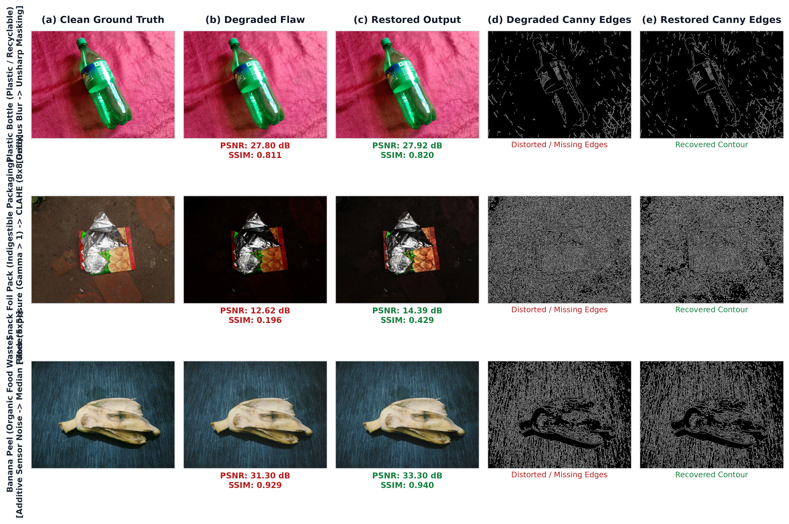
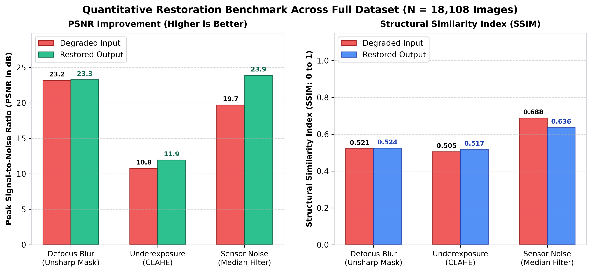

# Adaptive Image Quality Assessment and Targeted Restoration System
> **Course**: Digital Image Processing (CSE 4883) | **Institution**: United International University (UIU)  
> **Domain**: Smart Waste Bin Camera Systems & Computer Vision Pre-Processing  
> **Architecture Constraint**: Strictly Classical Digital Image Processing (Zero Deep Learning / Neural Networks)

[](https://www.python.org/)
[](https://opencv.org/)
[](https://www.docker.com/)
[](LICENSE)
[](docs/report.pdf)

---

## 📌 Executive Summary

Automated smart waste sorting bins rely on embedded optical camera sensors to photograph items discarded into intake hoppers. In real-world municipal environments, these sensors suffer from **severe visual corruptions**:
1. **Defocus Blur**: Lens grease, dust, moisture, or items falling outside the fixed Depth of Field (DoF).
2. **Container Underexposure**: Occlusions, deep bin geometry, and non-uniform illumination.
3. **High-Frequency Sensor Noise**: Thermal noise in low-cost CMOS sensors operating at high gain in dark bin interiors.

Passing degraded imagery directly into downstream classification algorithms causes catastrophic failure. Deep learning restoration models (e.g., DnCNN, Restormer) require gigabytes of VRAM and high latency, rendering them unusable on solar- or battery-powered edge hardware.

This project delivers an **end-to-end, zero-inference classical DIP pipeline** that:
* **Diagnoses** visual degradations in closed-form time ($\mathcal{O}(N)$, $<20$ ms per image on CPU).
* **Routes** imagery dynamically to exactly one targeted spatial/frequency filter (Unsharp Masking, CLAHE, or Median Filtering) to prevent compounding artifacts.
* **Recovers** sharp object contours verified via Otsu-adaptive Canny edge detection.
* Operates as a lightweight **243 MB headless Docker microservice**.

---

## 🖼️ Visual Results & Master Pipeline Benchmark


*Figure 1: Multi-class qualitative restoration comparison across municipal waste categories (Plastic Bottle, Snack Packaging, Organic Banana Peel). Columns (d) and (e) demonstrate Otsu-adaptive Canny edge contour recovery.*

---

## 📊 Quantitative Evaluation Metrics

Evaluated across **18,108 controlled test images** derived from the **BDWaste** and **UGV-NBWASTE** datasets:


*Figure 2: Peak Signal-to-Noise Ratio (PSNR) and Structural Similarity Index (SSIM) gains across all evaluated samples.*

### Aggregate Benchmark Table

| Flaw Category | Test Count | Degraded PSNR | Restored PSNR | PSNR Gain ($\Delta$) | Degraded SSIM | Restored SSIM | Primary Restoration Filter |
| :--- | :---: | :---: | :---: | :---: | :---: | :---: | :--- |
| **Defocus Blur** | 6,036 | 23.19 dB | **23.27 dB** | `+0.08 dB` | 0.5214 | **0.5244** | Unsharp Masking ($9 \times 9$, $\sigma=10$) |
| **Underexposure** | 6,036 | 10.77 dB | **11.93 dB** | `+1.16 dB` | 0.5048 | **0.5168** | CLAHE ($8 \times 8$ grid, clip limit 2.0) |
| **Sensor Noise** | 6,036 | 19.71 dB | **23.89 dB** | `+4.18 dB` | 0.6877 | **0.6364\*** | Rank-Order Median Filter ($5 \times 5$) |
| **OVERALL** | **18,108** | **17.89 dB** | **19.70 dB** | `+1.81 dB` | **0.5713** | **0.5592** | *Adaptive Triage Engine* |

*\*Note: Median filtering suppresses high-frequency noise grains, yielding a $+4.18\text{ dB}$ boost in PSNR while softening micro-variance relative to noise-free baselines.*

---

## 🏗️ System Architecture & Triage Routing

```
                  ┌─────────────────────────────────────┐
                  │       Input Image I(x, y)           │
                  └──────────────────┬──────────────────┘
                                     │
             ┌───────────────────────┼───────────────────────┐
             ▼                       ▼                       ▼
    [Laplacian Variance]  [Patch Percentile Noise]   [Global Photometric Mean]
    σ²_∇² = Var(I * L)    V_noise = P₁₀(Var(P_k))     μ_I = Mean(I)
             │                       │                       │
             ▼                       ▼                       ▼
      σ²_∇² < 300.0?         V_noise > 150.0?          μ_I < 80.0?
         (Blur)                  (Noise)                 (Dark)
             │                       │                       │
     ┌───────┴───────┐       ┌───────┴───────┐       ┌───────┴───────┐
    YES              NO     YES              NO     YES              NO
     │               │       │               │       │               │
     ▼               └──────►│               └──────►│               ▼
[Unsharp Masking]     (Check Noise)           (Check Dark)    [Pass-Through]
     │                       │                       │        Unmodified
     └───────────────────────┼───────────────────────┘           │
                             ▼                                   │
                  ┌─────────────────────┐                        │
                  │   Restored Output   │◄───────────────────────┘
                  └──────────┬──────────┘
                             │
                             ▼
                 [Otsu-Adaptive Canny Edges]
```

### Decoupled Noise Floor Estimation
Rather than calculating global image variance (which conflates high-frequency texture edges with sensor noise), the engine partitions the image into non-overlapping $16 \times 16$ patches. By evaluating the **10th percentile** of local patch variances ($\mathcal{P}_{10}$), the system isolates flat background regions where structural gradient is zero, obtaining an uncontaminated noise floor estimate:
$$\mathcal{V}_{\text{noise}} = \text{Percentile}_{10}\left( \{\text{Var}(\mathcal{P}_1), \dots, \text{Var}(\mathcal{P}_K)\} \right)$$

---

## 📁 Repository Structure

```
├── .dockerignore                 # Docker build exclusion rules
├── .gitignore                    # Git exclusion rules for data, cache, & build files
├── Dockerfile                    # Containerization manifest (Python 3.10-slim + OpenCV)
├── LICENSE                       # MIT License
├── README.md                     # Project documentation
├── docker-compose.yml            # Docker Compose orchestration & volume bindings
├── requirements.txt              # Minimal Python dependencies
│
├── src/                          # Core Python DIP Source Package
│   ├── __init__.py               # Package initialization
│   ├── pipeline.py               # Unified CLI Pipeline & Microservice Entrypoint
│   ├── phase1_degrade.py         # Phase 1: Synthetic Degradation Engine (Blur, Dark, Noise)
│   ├── phase2_diagnostics.py     # Phase 2: Closed-form Statistical Flaw Diagnostics
│   ├── phase3_restore.py         # Phase 3: Adaptive Triage Router & Restoration Filters
│   ├── phase4_evaluate.py        # Phase 4: Full Quantitative Evaluation (PSNR, SSIM)
│   ├── setup_dataset.py          # Dataset Extraction & Structuring Utility
│   └── generate_report_assets.py # Automated Figure & Chart Generation Script
│
├── docs/                         # Research Paper & Project Specifications
│   ├── PROJECT_REPORT.md         # Full Technical Specification Report
│   ├── Project_Master_Context.md # Core Constraints & Context Guide
│   ├── report.tex                # IEEE Conference Paper LaTeX Source
│   ├── report.pdf                # Compiled IEEE Format Research Paper
│   └── assets/                   # Visual Figures & Presentation Screenshots
│
└── data/ (Git-ignored)           # Runtime input/output directories & evaluation metrics CSV
```

---

## 🚀 Quickstart Guide

### 1. Prerequisites & Installation

Clone the repository and install dependencies:

```bash
git clone https://github.com/sadekinborno/adaptive-image-restoration-dip.git
cd adaptive-image-restoration-dip
pip install -r requirements.txt
```

---

### 2. Native CLI Execution

Run the unified restoration pipeline directly on custom images:

```bash
# Process an input folder and save restored images & Canny edge maps
python src/pipeline.py --input /path/to/input/images --output /path/to/output/folder --save-edges

# Run on a single image file
python src/pipeline.py -i data/degraded/sample.jpg -o data/restored/ --save-edges

# Output diagnostic metrics in machine-readable JSON format
python src/pipeline.py -i data/degraded/sample.jpg -o data/restored/ --json
```

#### Command Line Options

| Flag | Default | Description |
| :--- | :--- | :--- |
| `--input, -i` | `/app/input` | Path to single image file or directory of input images |
| `--output, -o` | `/app/output` | Path to output directory for restored results |
| `--blur-thresh` | `300.0` | Laplacian variance threshold ($\sigma^2_{\nabla^2}$) for blur detection |
| `--dark-thresh` | `80.0` | Global mean intensity threshold ($\mu_I$) for underexposure |
| `--noise-thresh` | `150.0` | Local patch variance threshold ($\mathcal{V}_{\text{noise}}$) for noise |
| `--limit, -n` | `None` | Process at most N images (ideal for fast test runs) |
| `--save-edges` | `False` | Extract and output Otsu-adaptive Canny edge maps |
| `--json` | `False` | Output diagnosis scores and metrics in JSON format |

---

### 3. Docker Container Execution (Phase 5)

The entire pipeline is containerized into a lightweight, headless Docker image running Python 3.10-slim and OpenCV.

#### Option A: Docker CLI
```bash
# Build the Docker image
docker build -t dip-waste-restoration:latest .

# Run container mounting local directories
docker run --rm \
  -v $(pwd)/data/degraded:/app/input \
  -v $(pwd)/data/docker_restored:/app/output \
  dip-waste-restoration:latest --save-edges
```

#### Option B: Docker Compose
```bash
docker compose up
```

---

### 4. Running Pipeline Phase Scripts Individually

You can also run individual phase modules sequentially:

```bash
# 1. Structure raw datasets
python src/setup_dataset.py

# 2. Generate synthetically degraded benchmark dataset
python src/phase1_degrade.py

# 3. Calculate statistical diagnostic metrics
python src/phase2_diagnostics.py

# 4. Route and restore degraded images
python src/phase3_restore.py

# 5. Run quantitative PSNR and SSIM benchmarks against ground truth
python src/phase4_evaluate.py

# 6. Generate report figures and charts
python src/generate_report_assets.py
```

---

## 📜 Research Paper & Documentation

The full academic IEEE conference paper detailing the mathematical formulations, triage logic, and empirical benchmarks is available at:
* 📄 **IEEE Paper PDF**: [`docs/report.pdf`](docs/report.pdf)
* 📝 **LaTeX Source**: [`docs/report.tex`](docs/report.tex)
* 📑 **Technical Specification**: [`docs/PROJECT_REPORT.md`](docs/PROJECT_REPORT.md)

---

## 📜 License

This project is licensed under the MIT License - see the [LICENSE](LICENSE) file for details.

---

## 🤝 Citation & Acknowledgments

If you find this classical DIP pipeline useful for your research or smart city applications, please cite our project work:

```bibtex
@article{dip_waste_restoration_2026,
  title={Adaptive Image Quality Assessment and Targeted Restoration for Smart Waste Bin Camera Systems},
  author={CSE 4883 DIP Team},
  journal={Department of Computer Science and Engineering, United International University},
  year={2026}
}
```
